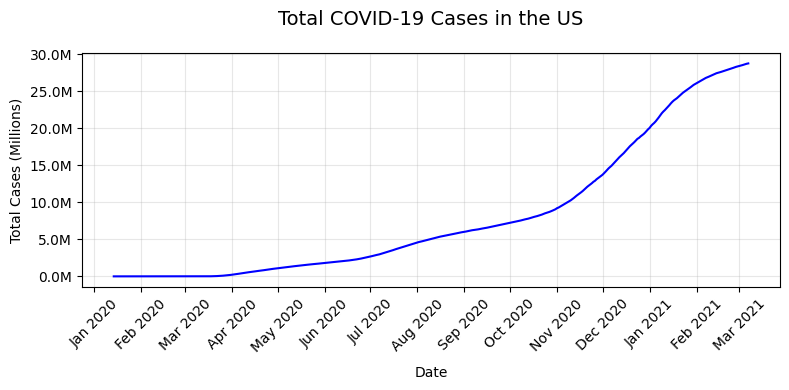
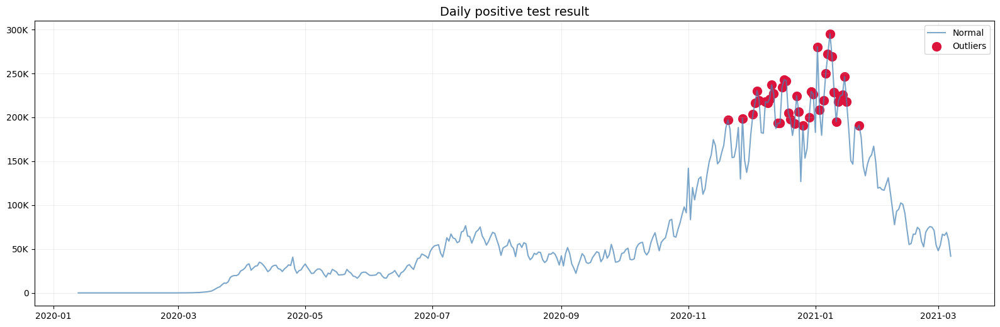
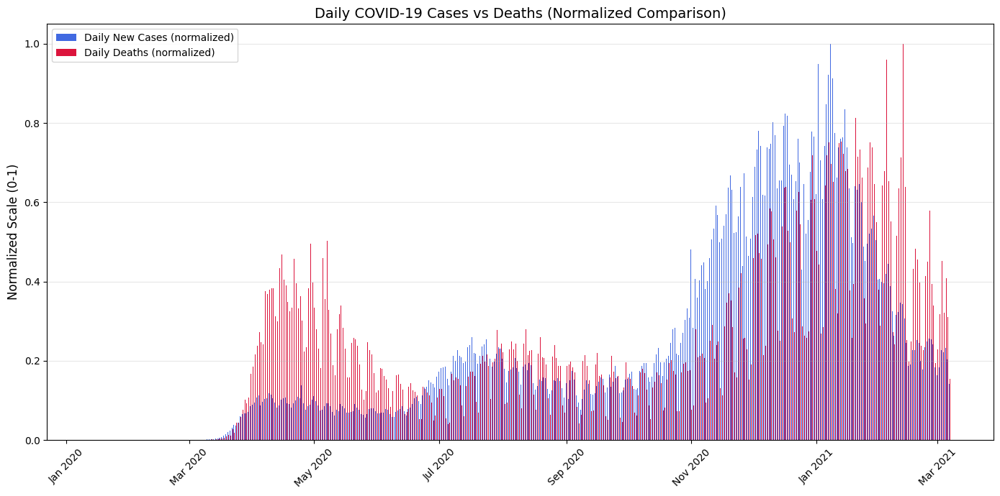
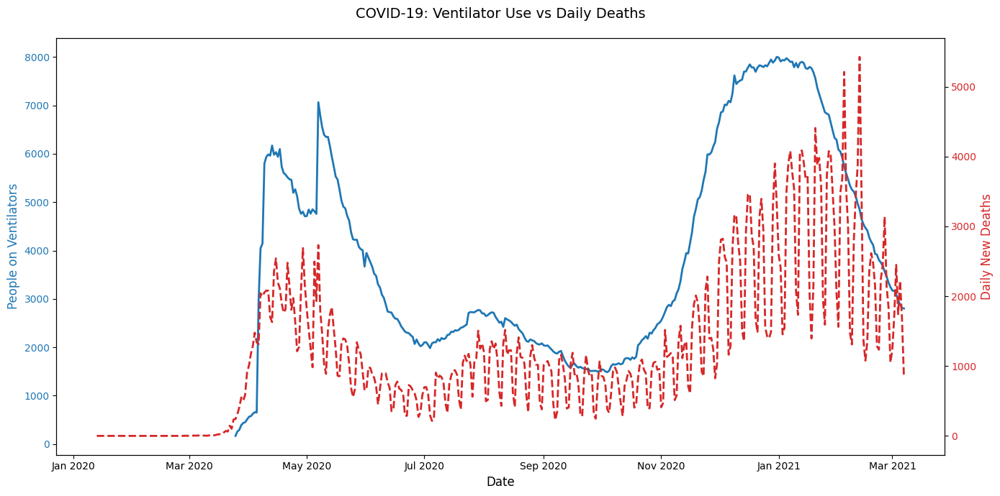
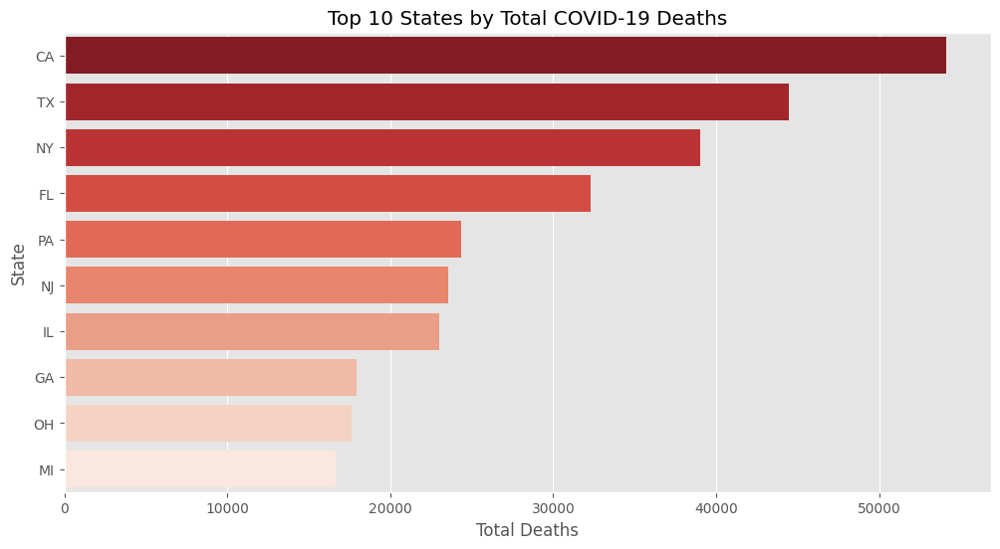
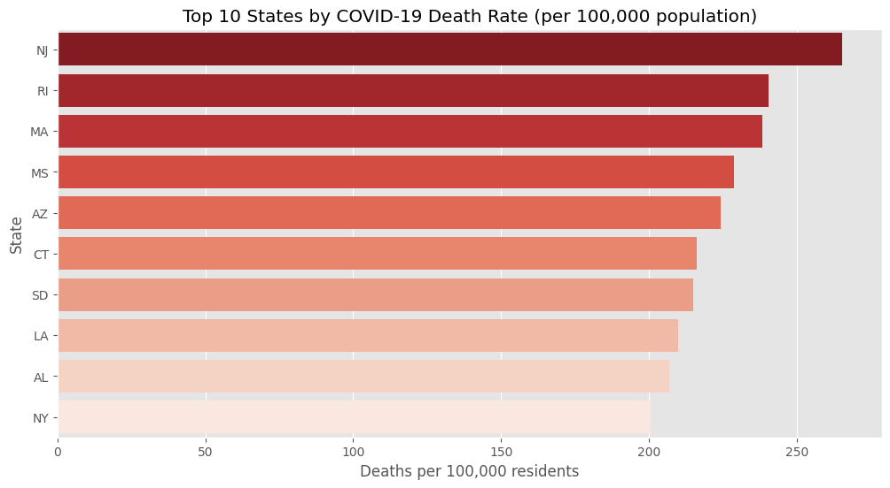
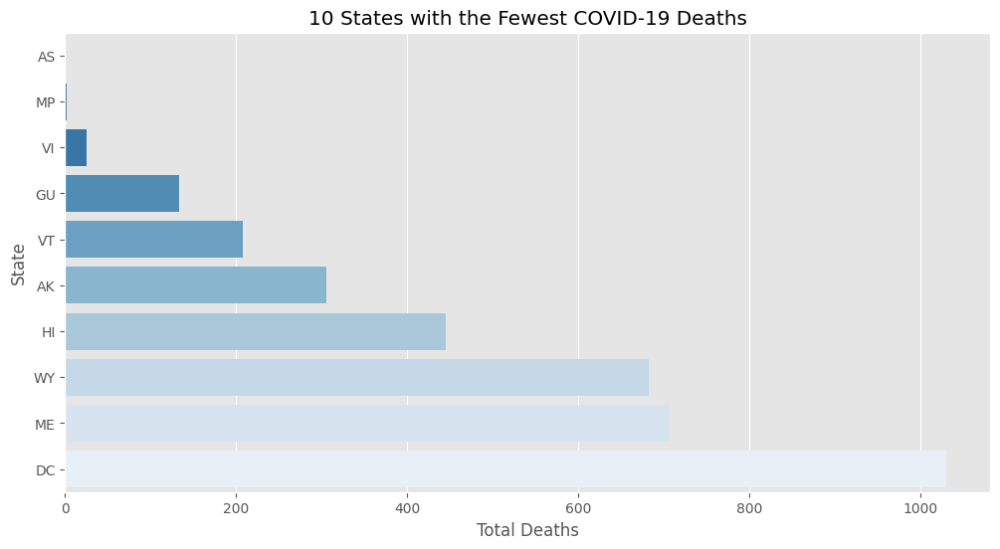
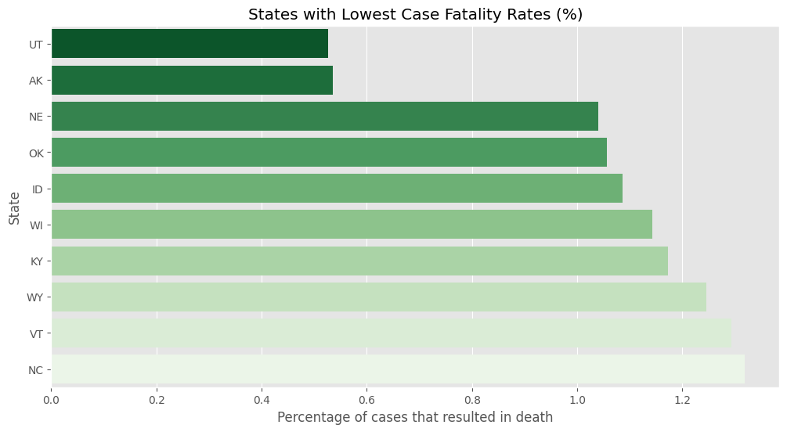

# Undertanding the pandemic trough data

## Introduction to the dataset
This analysis uses COVID-19 tracking data from the COVID Tracking Project API, focusing on US daily statistics and state-level data. The dataset includes critical metrics like positive/negative test results, hospitalizations, deaths, and testing capacity across the United States during the pandemic, providing a comprehensive view of the outbreak's progression and impact.

## Key findings from the Data
1. **Exponential early spread**
The data reveals the virus spread rapidly in its first wave, with cases growing exponentially. By April 2020, the U.S saw its first acceleration in transmission velocity, demonstrating how quickly COVID-19 could overwhelm unprepared systems. The dataset shows nearly 30 million total infections by its end date, with this initial surge setting the trajectory for the pandemic.

2. **Deadly winter surge**
The U.S experienced its most severe wave during 2020-2021 winter season, with cases and hospitalizations peaking at record levels. This surge occurred just before widespread vaccine rollout began to curb transmission, highlighting the critical window when public health measures were more strained.

3. **COVID to death correlation**
Analysis shows a consistent delay between infection spikes and subsequent mortality increases. As hospitals beds and ventilator became scarce during surges, the data demonstrates how resource limitations led to worse outcomes. When more people required hospitalization, death rates inevitably rose in following weeks.

4. **Ventilator use as a mortality predictor**
The strong correlation between ventilator usage spikes and subsequent death increases paints a grim picture of COVID's respiratory impact. When ventilator usage rose, mortality reliably followed 7-10 days later, underscoring the disease's attack on lung function and the life-saving importance of these devices.

5. **Absolute Death Toll**  
In raw numbers, the most populous states bore the heaviest burden:  
   - **California**: 50,000+ deaths  
   - **Texas**: 40,000+ deaths  
   - **New York**: 35,000+ deaths  
However, these totals reflect population density more than outbreak severity.

6. **Adjusted mortality rates**
When calculating deaths per 100,000 residents, the most severely affected states were:
   - **New Jersey (NJ):** 337 deaths/100k
   - **Rhode Island (RI):** 282 deaths/100k
   - **Massachusetts (NJ):** 275 deaths/100k
This metric accounts for population differences, showing where COVID was truly most deadly.

7. **Lowest Mortality Rates**
The least affected areas per capita were:
   - **American Samoa (AS):** 0 deaths
   - **Northern Mariana Islands**: 2 deaths
   - **Virgin Islands (VI):**  25 deaths
These places correspond to U.S territories, with a small population of less than 100,000 people. These places are remote locations and enforced aggressive lockdowns and quarantine measures

8. **Best recovery rates**
Survival rates were highest in Utah, Alaska and Nebraska.

These states likely benefited from younger population, less overwhelmed hospitals and effective early treatments

